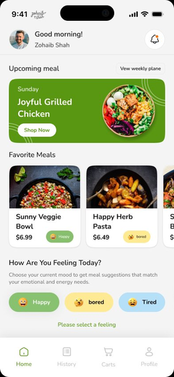
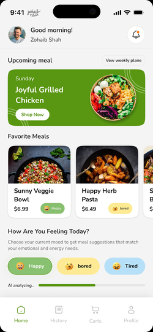
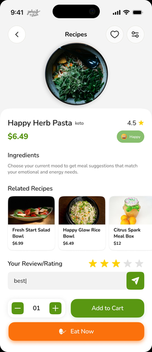
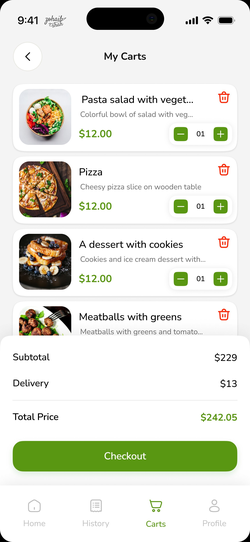
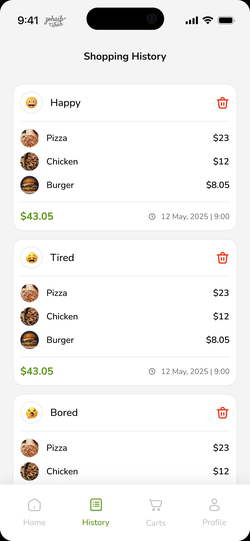
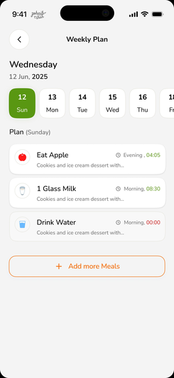
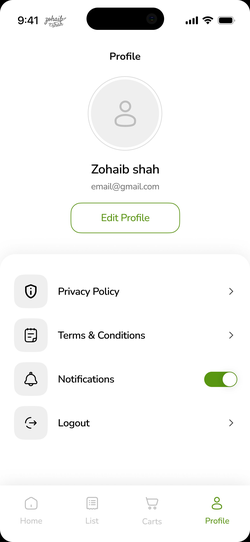
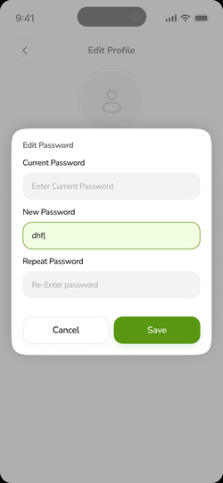

# 🍽️ Flutter Food Meals App

> A mood-based meal planning Flutter app with a clean UI, reusable custom widgets, GetX state management, and SOLID principles applied throughout.


---

## 🎯 Purpose

This project was built to practice:
- Building **reusable custom widgets** in Flutter
- Applying **SOLID principles** to UI component design
- **GetX** for state management and navigation
- Clean, production-style folder structure for Flutter apps

> This is a UI practice / design implementation project — not connected to a live backend.

---

## 📱 Screenshots

### Home & Mood Detection
<p align="center">
  
  &nbsp;
  
  &nbsp;
  
  &nbsp;
  
</p>

### Recipe, Cart & History
<p align="center">
  
  &nbsp;
  
  &nbsp;
  
</p>

### Weekly Plan & Profile
<p align="center">
  
  &nbsp;
  
  &nbsp;
  
</p>

---

## 🧩 Custom Reusable Widgets

All widgets live in `lib/core/widgets/` and are fully reusable across screens.

| Widget | Description |
|---|---|
| `MoodChipWidget` | Emoji + label chip used for mood selection (Happy, Bored, Tired) |
| `MealCardWidget` | Food card with image, name, price, and mood tag |
| `UpcomingMealBanner` | Full-width green banner showing next scheduled meal |
| `WeekDaySelector` | Horizontal scrollable date-day picker with active state |
| `MealPlanItemWidget` | Single meal plan row with icon, time, and label |
| `CartItemWidget` | Cart row with image, title, price, quantity +/- controls, and delete |
| `OrderHistoryCard` | Grouped order history card with mood header and item list |
| `CustomTextField` | Styled input with active/inactive border color states |
| `CustomBottomNavBar` | 4-tab bottom nav with active icon + label highlighting |
| `EditPasswordDialog` | Modal dialog with 3 password fields + Cancel/Save actions |

---

## 🏗️ SOLID Applied to Widgets

| Principle | How it's applied |
|---|---|
| **S** — Single Responsibility | Each widget does one thing — `MoodChipWidget` only renders a mood chip |
| **O** — Open/Closed | Widgets accept parameters — extend behavior without modifying widget code |
| **L** — Liskov Substitution | All custom buttons follow the same base interface — swappable |
| **I** — Interface Segregation | Widgets only expose props they actually need |
| **D** — Dependency Inversion | Widgets receive data via constructor — no hardcoded dependencies |

---

## 🛠️ Tech Stack

| Layer | Technology |
|---|---|
| Language | Dart |
| Framework | Flutter |
| State Management | GetX |
| Navigation | GetX Named Routes |
| Architecture | SOLID + Feature-first folder structure |
| UI | Custom Widgets + Material Design |

---

## 📁 Project Structure

```
lib/
├── core/
│   └── widgets/          # All reusable custom widgets
├── features/
│   ├── home/             # Home screen + mood detection
│   ├── recipe/           # Recipe detail screen
│   ├── cart/             # Cart + checkout
│   ├── history/          # Shopping history
│   ├── weekly_plan/      # Weekly meal planner
│   └── profile/          # Profile + edit password
└── main.dart
```

---

## 🚀 Getting Started

1. Clone the repository:
   ```bash
   git clone https://github.com/ahsanshah4105/flutter-food-meals.git
   cd flutter-food-meals
   ```

2. Install dependencies:
   ```bash
   flutter pub get
   ```

3. Run the app:
   ```bash
   flutter run
   ```

---

## 📞 Contact

[](https://linkedin.com/in/ahsanalishah4105)[](mailto:ahsanalishah4105@gmail.com)
